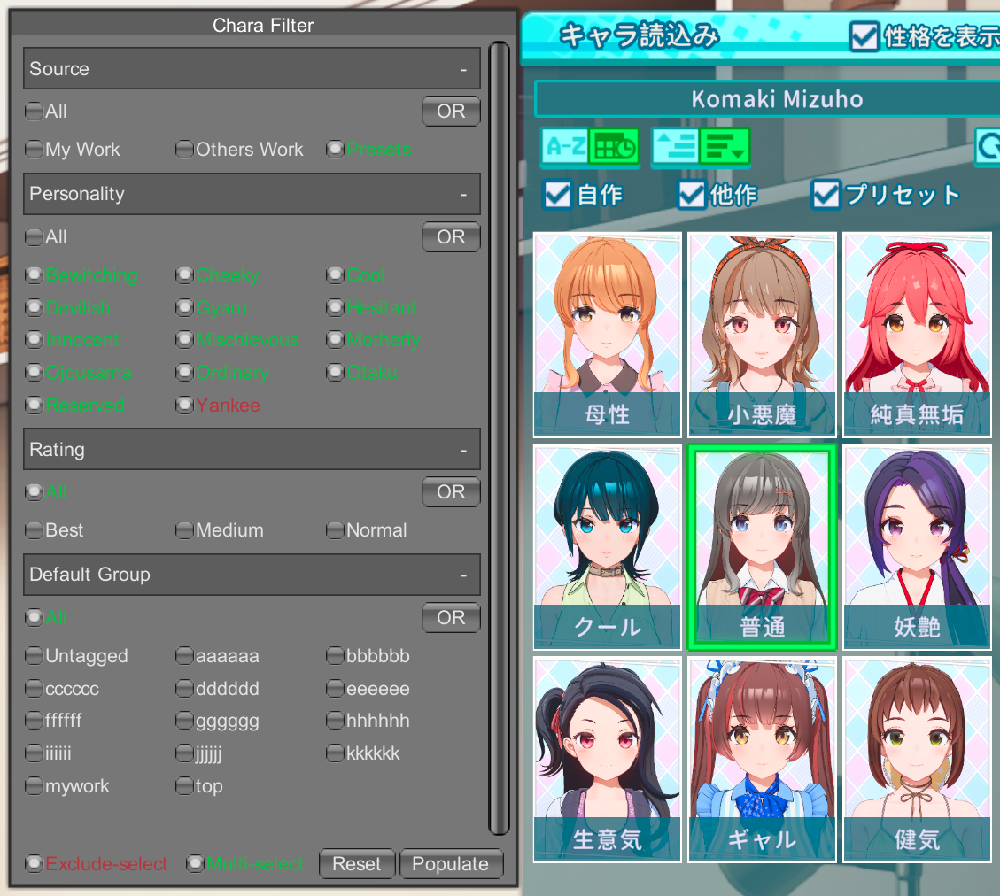

# ILL_PLUGINS

y0soro's BepInEx Plugins for ILLGAMES.

## SVS_CharaFilter / DC_CharaFilter

Character/coordinate card filter for SVS and DigitalCraft.

It allows you to filter character/coordinate cards with personalities and folder categories that managed by yourself.

This is extremely useful if you have hundreds of character cards that the original selector failed to satisfy filtering needs.

Currently this works for character/coordinate selection in character/coordinate creation scene, character fusion scene, uploader scene and
character selection scene in "town" entry.

For DC_CharaFilter, you would need DigitalCraft>=2.0.0 with SVS support.

Update [UI translation](src/SVS_CharaFilter/CharaFilterCore/Resources/Translation/) there.

### Dependency

-   `BepInEx.KeyboardShortcut.dll` for IL2CPP from https://github.com/BepInEx/BepInEx.ConfigurationManager

### Usage

To categorize cards, create a folder with your category name in character/coordinate folder (e.g. `UserData/chara/female/`) and move cards into the former (e.g. `UserData/chara/female/foo`). Note to not put invalid filename characters into folder name otherwise card loading would fail.

You can also tag a single card by adding `[TAG]` to filename of png card, e.g. `[bar] MyChara.png`.

#### Features

-   "Multi-Select": When toggled off, you can only select one tag in each filtering group. When toggled on, you can also filtering multi cards in the same group, with AND or OR logic between selected tags.
-   "Exclude-Select": When toggled on, cards matching tags you selected next would be filtered out.
-   "Populate": Feed backs the tags of current selected card to filter UI. Useful if you don't remember the tags which current card belongs to.

### Advanced Usage

You can control the group to which the current tag would be added by using advanced tag modifier syntax of `TAG` name.

For instance, to specify tag `Great` and add it to group `Rating`. The modifier syntax would be `{g=Rating}Great`, either use it as name of folder containing card files or add it into a `[]` block in filename of png card. For example,

-   in Folder name: `{g=Rating}Great` or `Great{g=Rating}`, the position of tag modifier does not matter
-   in card filename : `[{g=Rating}Great] MyChara.png`

Except `{g=<group name>}` modifier, there's also modifiers to control group order, group multi-selectability and tag order.

-   `{g=<group name>}` or `{group=<...>}`, defaults to `Default Group`.
-   `{go=<group order>}` or `{groupOrder=<...>}`, integer, defaults to `100` of `Default Group`, otherwise defaults to `0`.
-   `{o=<tag order>}`, `{to=<...>}`, `{order=<...>}` or `{tagOrder=<...>}`, integer, defaults to `0`.
-   `{m=<multi-selectable>}`, multi-selectable in AND mode, enabled if it's `{m=1}`, default to disable multi-select in AND mode.

For `{go=<group order>}` and `{m=<multi-selectable>}`, you only need to specify them once for a group in a tag. And you can omit them for other tags belongs to the same group.
Same applies to `{o=<tag order>}` for cards share the same group tag.

An example of tag name with all these modifiers would be:

-   in Folder name: `{g=Rating}{go=1}{m=1}{o=1}Great`
-   in card filename : `[{g=Rating}{go=1}{m=0}{o=2}Medium] MyChara.png`

## WebRequestMask

Mask unwanted Web requests initiated with `UnityWebRequest`.

This is similar to WebRequestBlocker but without hardcoded internal HTTP server port.

For instance, this would allows you to launch both DigitalCraft and SVS without one of them yelling "Connection failed" due to port allocation collision that causes one of the internal HTTP server failed to start (on Linux).

This also allows you to configure a HTTP proxy bypassing TLS certification checks, so you can intercept `UnityWebRequest` traffic with mitmproxy easily.
